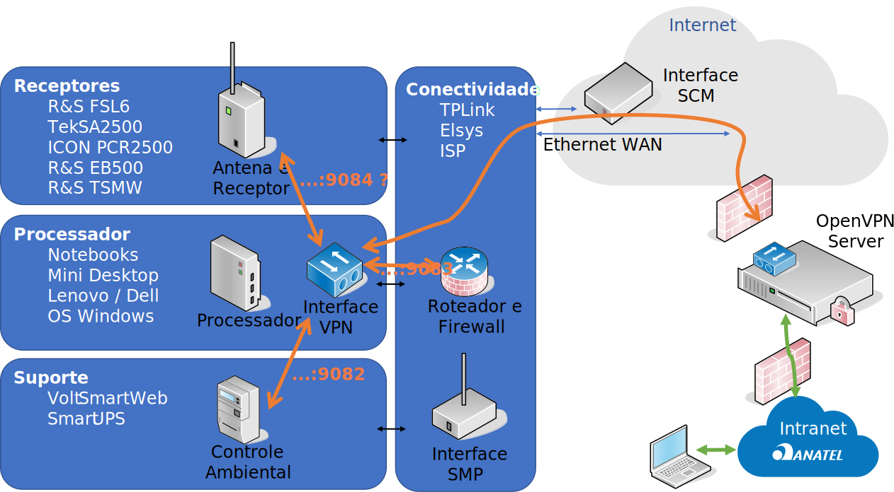

<!-- Improved compatibility of back to top link: See: https://github.com/othneildrew/Best-README-Template/pull/73 -->

<!-- PROJECT SHIELDS -->
<!--
*** based on https://github.com/othneildrew/Best-README-Template
*** Reference links are enclosed in brackets [ ] instead of parentheses ( ).
*** See the bottom of this document for the declaration of the reference variables
*** for contributors-url, forks-url, etc. This is an optional, concise syntax you may use.
*** https://www.markdownguide.org/basic-syntax/#reference-style-links
-->
<!-- TABLE OF CONTENTS -->

  
Table of Contents

  <ol>
    <li><a href="#about-RF.Fusion">About RF.Fusion</a></li>
    <li><a href="#roadmap">Roadmap</a></li>
    <li><a href="#contributing">Contributing</a></li>
    <li><a href="#license">License</a></li>
    <li><a href="#additional-references">Additional References</a></li>
  </ol>

<!-- ABOUT THE PROJECT -->
# About ERMx

ERMX is the acronym for "Estação Remota de Monitoramento" with the added letter "x" as a reference to a variable, since the objective is to provide a framework to construct a usefull spectrum monitoring station from assorted components, that may be adapted to the specific needs of each project.

This repository stores the documentation and scripts for the installation and configuration of the main components of the ERMx project.

The following figure presents a general view main elements for ERMx.

- **Antenna & Receiver:** Is the data acquisition front-end, from the RF receiving antennas to the digitizer and DSP units that provides data streams with IF IQ data, spectrum sweeps, demodulated data and alarms. Each equipment may provide a different set of data as output.
- **Processor:** Is a generic data processor running linux or windows. It's the local brain of the monitoring station, responsible to perform data requests to the acquisition front-end, any additional processing for data analysis and tagging. It also manage interfaces and the local data repository.
- **Support and Environment Control:** may be composed of several elements that are accessory to the measurement, such as temperature control, security detectors, cameras, UPS and power supply management, etc.
- **Router, Firewall and Network Interfaces:** may be composed of several elements that interconnect elements within the station and from it to the outside world. Common solutions provide up to 3 interfaces including an ethernet cable, an integrated 4G or 5G modem to connect to to the mobile WAN network and a VPN connection, that allows for a secure communication with the server core

(<a href="#indexerd-md-top">back to top</a>)

<!-- ROADMAP -->
# Roadmap

* [ ] Create main repository and upload existing data
  * [x] Complete base upload
  * [ ] Upload additional data from related projects
    

See the [open issues](https://github.com/othneildrew/Best-README-Template/issues) for a full list of proposed features (and known issues).

(<a href="#indexerd-md-top">back to top</a>)

<!-- CONTRIBUTING -->
# Contributing

Contributions are what make the open source community such an amazing place to learn, inspire, and create. Any contributions you make are **greatly appreciated**.

If you have a suggestion that would make this better, please fork the repo and create a pull request. You can also simply open an issue with the tag "enhancement".
Don't forget to give the project a star! Thanks again!

1. Fork the Project
2. Create your Feature Branch (`git checkout -b feature/AmazingFeature`)
3. Commit your Changes (`git commit -m 'Add some AmazingFeature'`)
4. Push to the Branch (`git push origin feature/AmazingFeature`)
5. Open a Pull Request

(<a href="#indexerd-md-top">back to top</a>)

<!-- LICENSE -->
# License

Distributed under the GNU General Public License (GPL), version 3. See [`LICENSE.txt`](.\LICENSE) for more information.

For additional information, please check <https://www.gnu.org/licenses/quick-guide-gplv3.html>

This license model was selected with the idea of enabling collaboration of anyone interested in projects listed within this group.

It is in line with the Brazilian Public Software directives, as published at: <https://softwarepublico.gov.br/social/articles/0004/5936/Manual_do_Ofertante_Temporario_04.10.2016.pdf>

Further reading material can be found at:
- <http://copyfree.org/policy/copyleft>
- <https://opensource.stackexchange.com/questions/9805/can-i-license-my-project-with-an-open-source-license-but-disallow-commercial-use>
- <https://opensource.stackexchange.com/questions/21/whats-the-difference-between-permissive-and-copyleft-licenses/42#42>

(<a href="#indexerd-md-top">back to top</a>)

# Additional References

(<a href="#indexerd-md-top">back to top</a>)

<!-- MARKDOWN LINKS & IMAGES -->
[ermx_overview]: ./docs/img/SMN_overview.svg

